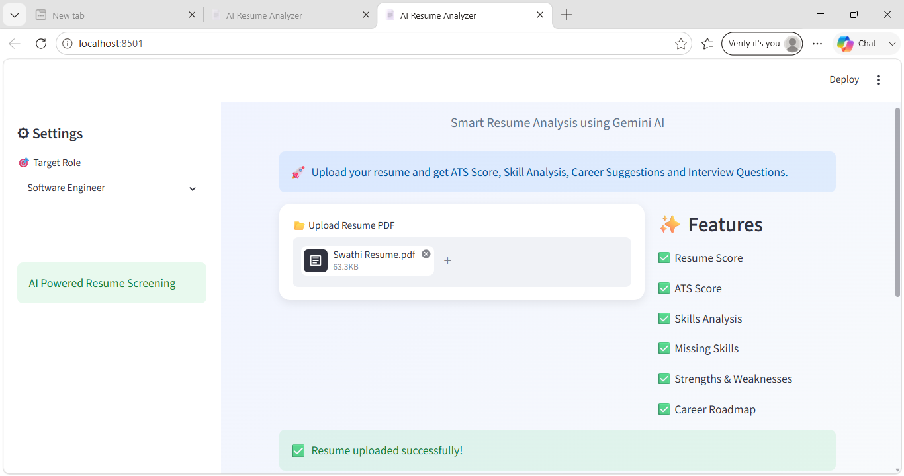
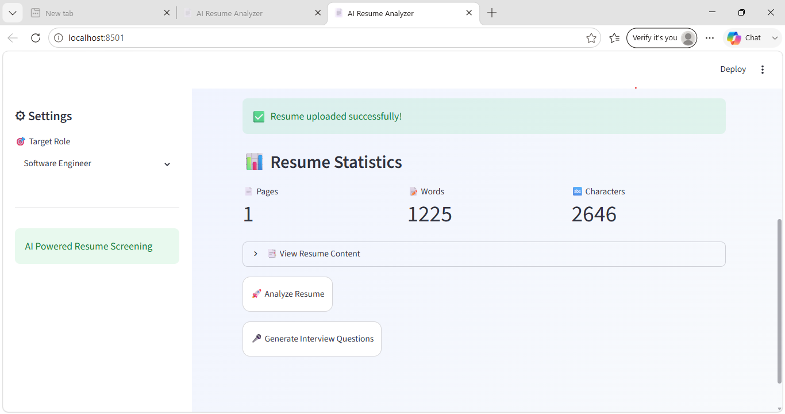
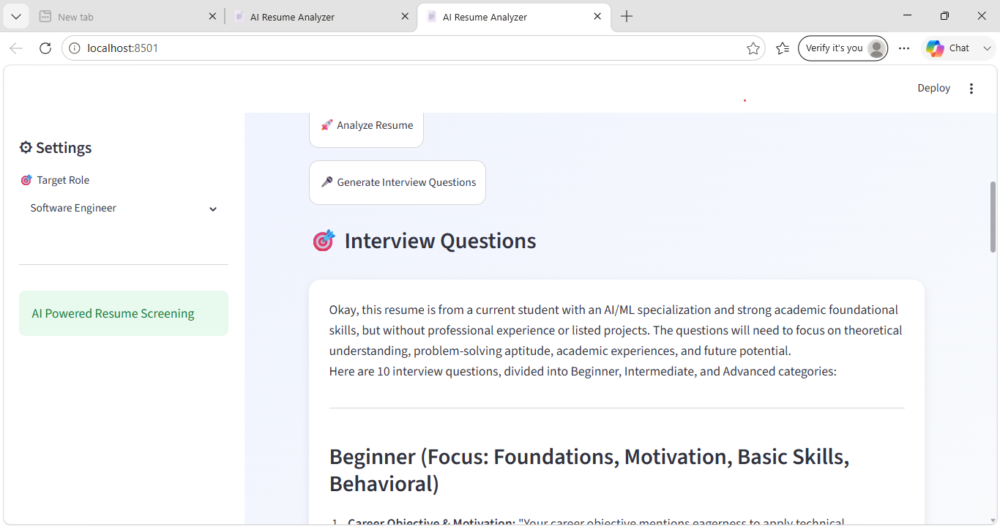

# 📄 AI Resume Analyzer

An AI-powered Resume Analyzer built using Streamlit and Google Gemini AI. Upload a PDF resume and receive ATS scores, skill analysis, improvement suggestions, career guidance, and interview questions.

## 🚀 Features

* 📊 Resume Score Analysis
* 🎯 ATS Score Evaluation
* 🧠 Skills Identification
* ❌ Missing Skills Detection
* 💪 Strengths & Weaknesses Analysis
* 📈 Career Roadmap Suggestions
* 🎤 Interview Question Generation

## 🛠️ Tech Stack

* Python
* Streamlit
* Google Gemini AI
* PyPDF
* Python-dotenv

## 📸 Screenshots

### Resume Upload Page



### AI Analysis Result



### Interview Questions



## ▶️ Run Locally

```bash
pip install -r requirements.txt
streamlit run app.py
```

## 📜 License

MIT License

## 👩‍💻 Author

Swathi
